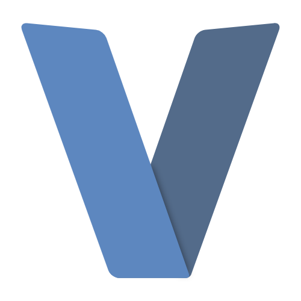

# Introduction

Hello! I am Poly, an aspiring Systems Developer.

# Languages & Tools
</img> </img> </img> </img> </img> </img> </img> </img>

# Currently Learning
</img>

# Other Accounts
 Discord: Poly#8563</img>
  
 Dev.to: PolyLmao</img>

# My Most Used Languages List

# My Github Stats List

